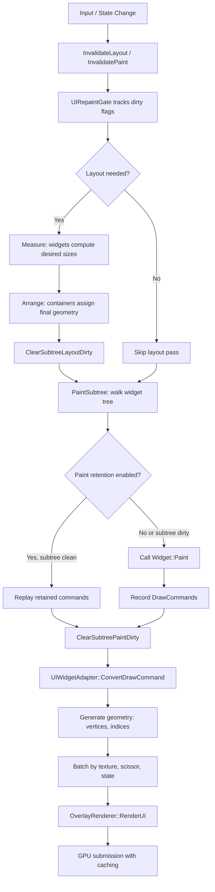

# KindUI

KindUI is a retained-mode UI framework for the WindEffects Engine. It implements widget composition, layout, rendering, theming, and editor integration for tool interfaces and application UI.

## Architecture Overview

KindUI separates UI construction into distinct layers:

- **Widget layer**: Retained widget tree with Measure/Arrange/Paint lifecycle, interaction state, and invalidation tracking
- **Layout layer**: Flex and Grid containers that determine widget geometry from constraints
- **Paint layer**: Immediate-mode recording API that generates draw commands
- **Render layer**: Command-to-geometry conversion and GPU submission with batching and caching
- **Theme layer**: Design token system that separates visual values from UI logic
- **Composition layer**: Declarative Element descriptions with incremental reconciliation
- **Editor DSL layer**: High-level declarative API for building editor panels

## The UI Pipeline

The frame-to-frame flow of a KindUI UI:



### Widget Lifecycle

Widgets are reference-counted (`std::shared_ptr<Widget>`) and form a tree hierarchy. Each widget implements three core virtual methods:

- `Measure(Size availableSize)`: Returns desired size given constraints. Layout containers measure children recursively.
- `Arrange(Rect allottedRect)`: Sets widget geometry (`m_Geometry`) and arranges children into final positions.
- `Paint(PaintContext& context)`: Records draw commands for the widget and its children.

Widgets maintain interaction state (hovered, pressed, focused, selected, enabled, visible, collapsed). State changes trigger invalidation through `InvalidateLayout()`, `InvalidatePaint()`, or `InvalidateStyle()`.

### Invalidation and Dirty Tracking

KindUI tracks invalidation at two levels to enable efficient partial updates:

**Per-widget flags:**
- `m_NeedsLayout`: Widget needs Measure/Arrange
- `m_NeedsPaint`: Widget needs Paint
- `m_NeedsStyle`: Widget needs style re-resolution

**Subtree aggregation flags:**
- `m_SubtreeNeedsLayout`: Set on ancestors when any descendant needs layout
- `m_SubtreeNeedsPaint`: Set on ancestors when any descendant needs paint

When a widget calls `InvalidateLayout()` or `InvalidatePaint()`, the dirty flag propagates upward to all ancestors. This enables O(1) dirty checks via `SubtreeNeedsLayout()` and `SubtreeNeedsPaint()`—no tree traversal needed to determine if a subtree needs work.

```cpp
void Widget::InvalidateLayout() {
    InvalidateRetainedPaintUpward();
    if (m_NeedsLayout) return;
    m_NeedsLayout = true;
    m_SubtreeNeedsLayout = true;
    auto p = m_Parent.lock();
    while (p) {
        p->m_NeedsLayout = true;
        p->m_SubtreeNeedsLayout = true;
        p = p->m_Parent.lock();
    }
    UIRepaintGate::RequestLayout();
}
```

### UIRepaintGate

`UIRepaintGate` provides global dirty-state gating for editor chrome. It tracks layout and paint separately so hover-only changes avoid full Measure/Arrange passes. The gate uses atomic flags for thread-safe invalidation requests from any thread.

Key features:
- Separate `RequestLayout()` and `RequestPaint()` for fine-grained invalidation
- `MarkAnimating()` for hover/press damping—keeps paint dirty while animations settle
- `ScopedBatch` for multi-step structural operations (dock/float panels) to collapse invalidations into a single pass
- `ConsumeNeedsLayout()` and `ConsumeNeedsPaint()` for the render thread to check and clear dirty flags

```cpp
// Collapse multiple structural edits into one layout pass
{
    UIRepaintGate::ScopedBatch batch;
    panel->AddChild(newChild);
    dockContainer->FloatPanel(panel);
} // EndBatch fires a single RequestLayout
```

### Layout

Layout containers determine widget geometry. KindUI provides two container types:

**Flex**: CSS-flexbox-inspired container supporting:
- Direction (row/column/reverse)
- Wrap behavior
- Justify-content (start/end/center/space-between/space-around/space-evenly)
- Align-items (start/end/center/stretch)
- Gap and padding
- Background and border radius

Children use widget flex properties (grow, shrink, basis) and margins. Flex resolves child sizes in two passes: Measure computes desired sizes, Arrange allocates final space with remaining space distributed by grow factors.

**Grid**: CSS-grid-inspired container with:
- Fixed, fractional (`fr`), and auto track sizing
- Column and row span placement
- Gap and padding

Layout runs conditionally in `UIWidgetAdapter::ProcessWidget`. It skips Measure/Arrange when the root was already laid out for the current viewport size and the tree is not dirty. This optimization avoids redundant layout on paint-only frames.

### Painting and Draw Commands

Painting uses an immediate-mode recording API through `PaintContext`. Widgets call draw methods which append commands to a vector:

```cpp
void MyWidget::Paint(PaintContext& ctx) {
    ctx.DrawSurface(rect, SurfaceRole::Panel, radius);
    ctx.DrawText(label, textPos, ThemeColor(ColorToken::TextPrimary));
    ctx.DrawWindIcon(icon, iconRect);
}
```

PaintContext supports:
- Clip rect stacking (`PushClipRect`/`PopClipRect`)
- Semantic surface owner scoping (`PushSurfaceOwner`/`PopSurfaceOwner`) for theme-aware rendering
- Text measurement via `GetTextWidth()`
- Direct command appending for batching

Draw commands include: Rect, Gradient, Shadow, RoundedOutline, Text, Icon, Line, Texture, ColorTexture.

### Paint Retention

KindUI supports retained painting with dirty-subtree optimization. On paint-only rebuilds (no layout change), clean subtrees replay retained command lists without widget traversal. Dirty subtrees call `Paint()` and refresh retention.

Each widget stores:
- `m_RetainedPaintValid`: Whether retained commands are current
- `m_RetainedPaintBegin`/`m_RetainedPaintEnd`: Slice indices in the global command store
- `m_RetainedPaintStore`: Opaque pointer to the retained command vector

`PaintSubtree` checks retention before calling `Paint()`:

```cpp
void Widget::PaintSubtree(PaintContext& context) {
    if (!m_Visible) {
        ClearSubtreePaintDirty();
        return;
    }

    const bool canReplay = context.IsPaintRetentionEnabled()
        && m_RetainedPaintValid
        && static_cast<bool>(m_RetainedPaintStore)
        && !SubtreeNeedsPaint();

    if (canReplay) {
        // Replay retained commands without widget traversal
        const auto& store = *std::static_pointer_cast<const RetainedPaintStore>(m_RetainedPaintStore);
        context.AppendCommands(store, m_RetainedPaintBegin, m_RetainedPaintEnd);
        return;
    }

    // Paint and refresh retention
    const size_t commandStart = context.CommandCount();
    Paint(context);
    // Store slice for future replay...
}
```

Paint retention is disabled on layout frames because geometry changes invalidate retained slices.

### Geometry Generation

`UIWidgetAdapter::ProcessWidget` is the bridge between widget trees and GPU rendering. After painting, it converts DrawCommands to geometry:

```cpp
// In UIWidgetAdapter::ProcessWidget
for (const auto& cmd : commands) {
    ConvertDrawCommand(cmd);  // Generates vertices/indices
}
```

Conversion branches by command type:
- `GenerateRectGeometry`: Quad vertices with rounded corner support
- `GenerateTextGeometry`: Text via TextUIService (MSDF font atlas)
- `GenerateIconGeometry`: Icons via IconRenderer (SVG rasterization)
- `GenerateTextureGeometry`: Image draws with texture descriptor sets
- `GenerateLineGeometry`: Border lines
- `GenerateShadowGeometry`: Drop shadows
- `GenerateGradientGeometry`: Vertical gradients
- `GenerateRoundedOutlineGeometry`: Stroked rounded rectangles

Geometry is batched by:
- Texture descriptor set (minimizes texture switches)
- Scissor rect (clipping regions)
- Text flag (text vs non-text requires different shader parameters)
- Opaque replace flag (compositing mode)

Batches merge when consecutive commands share the same state, reducing draw calls.

### GPU Rendering

`OverlayRenderer` manages the GPU pipeline:

- **Initialization**: Creates RHI pipelines, vertex/index buffers, and descriptor sets
- **Frame rendering**: `RenderUI(root, frameSlot)` triggers UIWidgetAdapter::ProcessWidget
- **Submission caching**: When geometry is unchanged, reuses the previous RHI draw list instead of rebuilding
- **Texture management**: `RegisterTexture`/`UpdateTexture`/`UnregisterTexture` for dynamic textures
- **Diagnostics**: Tracks frame stats (draw calls, vertices, indices, batches) and timing (build CPU ms, submit CPU ms)

The renderer uses a single UI shader with parameters for:
- Texture binding
- SDF params for text (atlas size, pixel range)
- Scissor rect
- Compositing mode (opaque replace vs alpha blend)

## Theming

KindUI uses a design token system for visual values. Tokens are semantic enums that separate UI logic from visual appearance:

**ColorToken**: 70+ semantic colors (WindowBackground, PanelBackground, HoverBackground, TextPrimary, AccentPrimary, etc.)

**MetricToken**: Layout metrics (ControlHeight, ButtonHeight, PanelHeaderHeight, IconSizeToolbar, etc.)

**SpacingToken**: Spacing scale (None, ExtraSmall, Small, Medium, Large, ExtraLarge, Huge)

**RadiusToken**: Corner radius (None, Small, Medium, Large, Full)

**TypographyToken**: Font roles (WindowTitle, Body, Caption, Button, Code, etc.)

**PaddingToken**: Common padding presets (Panel, Button, Card, Input, FormRow)

**ElevationToken**: Shadow intensity (None, Window, Panel, Card, Control, Overlay, Popup)

**AnimationToken**: Durations (Instant, Fast, Normal, Slow)

Themes implement `IKindUITheme` to resolve tokens:

```cpp
class IKindUITheme {
    virtual Color ResolveColor(ColorToken token) const = 0;
    virtual float ResolveMetric(MetricToken token) const = 0;
    virtual Margin ResolvePadding(PaddingToken token) const = 0;
    virtual float ResolveSpacing(SpacingToken token) const = 0;
    virtual float ResolveRadius(RadiusToken token) const = 0;
    virtual float ResolveFontSize(TypographyToken token) const = 0;
    virtual int ResolveElevation(ElevationToken token) const = 0;
    virtual float ResolveAnimationDuration(AnimationToken token) const = 0;
};
```

`ThemeManager` is the singleton that holds the active theme and style resolver:

```cpp
ThemeManager::Get().Initialize(std::make_shared<GraphiteDarkTheme>(), dpiScale);
```

Widgets access theme values through helper methods:
- `ThemeColor(ColorToken)`: Resolve a color token
- `ThemeMetric(MetricToken)`: Resolve a metric token
- `ThemePadding(PaddingToken)`: Resolve a padding token
- `ResolveStyle(StyleRole)`: Resolve a semantic role to a ResolvedStyle

`StyleRole` provides semantic widget categories (Button, Panel, Tab, Input, Toolbar, etc.) for style resolution. `ResolvedStyle` contains the final style properties (background, foreground, border, cornerRadius, fontSize, padding, etc.).

KindUI includes `GraphiteDarkTheme` as the default implementation. Themes contain no branding—visual values are entirely token-driven.

## Composition

The composition layer provides declarative UI building with incremental reconciliation:

**Element**: Tree structure describing UI with:
- `type`: Widget type (Row, Column, Flex, Grid, Button, Label, etc.)
- `id`: Optional identifier for reuse during reconciliation
- `text`, `subtitle`, `icon`: Content properties
- `layout`: LayoutIntent (flex properties, margins, min/max size, alignment)
- `style`: StyleIntent (design tokens for background, padding, radius, typography)
- `events`: Event handlers (onClicked, onValueChanged, etc.)
- `children`: Child elements
- `when`: Conditional inclusion predicate
- `forEach`: Collection expansion callback
- `host`: Custom widget factory for application-specific components

**ViewBuilder**: Converts Element trees to Widget trees with incremental reconciliation:
- `Build(Element)`: Full build from an Element description
- `Reconcile(Widget&, Element)`: Incremental update of an existing widget tree
- Reuses widgets when element types and IDs match (`ElementsMatchForReuse`)
- Applies LayoutIntent and StyleIntent to widgets
- Reconciles children by ID matching, inserting new widgets and removing unused ones

**ViewHost**: Retains a widget tree with optional view factory:
- `SetView(Element)`: Set the view description
- `Reconcile(Element)`: Incrementally update the view
- `SetViewFactory(std::function<Element()> factory)`: Set a factory for auto-refresh
- `Observe(Observable<T>&)`: Subscribe to observables for automatic refresh
- `Refresh()`: Rebuild from the current factory or description

Composition is optional—widgets can be instantiated and assembled directly. The Element system is used by the Editor DSL and provides a functional UI description.

## Editor DSL

The Editor DSL (`we::editor::dsl`) provides a declarative API for building editor panels.

**Entry points:**
```cpp
#include <KindUI/EditorUI.h>
using we::editor::dsl::Panel;

auto inspector = Panel("Inspector", [](PanelContext& p) {
    p.Section("Transform", [](auto& s) {
        s.Property("Location", locationWidget);
    });
});
```

**PanelContext**: Builds panels with:
- `Section(title, buildSection)`: Add collapsible sections
- `Toolbar(buildToolbar)`: Add a toolbar row
- `Search(placeholder, onQueryChanged)`: Add a search box
- `FilterStrip(tabs, onTabSelected)`: Add a tab filter strip
- `Tree(id, items, onItemClicked)`: Add a tree view
- `AssetGrid(widget)`: Add an asset grid
- `Viewport(widget)`: Add a viewport
- `Tabs(buildTabs)`: Add tab pages
- `Content(widget)`: Add custom content
- `WithCloseButton(onClose)`: Add a close button
- `Transparent(bool)`: Make panel background transparent

**SectionContext**: Builds property rows with type-specific field builders:
- `Field(label, widget, config)`: Generic property row
- `Bool(label, value, config)`: Boolean checkbox
- `Int/Float/Double(label, value, config)`: Numeric fields
- `Slider(label, value, min, max, step, config)`: Slider control
- `String(label, value, multiline, config)`: Text field
- `Enum(label, value, options, config)`: Enum dropdown
- `Flags(label, value, flagBits, config)`: Bitmask flags
- `Vector2/Vector3/Vector4(label, values, config)`: Vector fields
- `Rotation(label, euler, config)`: Rotation field
- `Transform(label, transform, config)`: Transform field
- `Color(label, rgba, includeAlpha, config)`: Color picker
- `Asset(label, path, extension, config)`: Asset picker
- `ObjectRef/ClassRef(label, ref, config)`: Object/class references
- `Container(label, elements, config)`: Container editor
- `Button(label, onClick)`: Action button

**FieldConfig**: Configuration for field behavior:
- `ToolTip(string)`: Tooltip text
- `ReadOnly(bool)`: Make field read-only
- `Disabled(bool)`: Disable field
- `Modified(bool)`: Show modified indicator
- `OnChanged(callback)`: Change notification
- `OnReset(callback)`: Reset button handler

**ToolbarContext**: Builds toolbar rows with:
- `Button(label, onClick)`: Text button
- `Button(label, icon, onClick)`: Button with icon
- `IconButton(icon, onClick)`: Icon-only button
- `Search(placeholder, onQueryChanged)`: Search box
- `Separator()`: Visual separator
- `Custom(widget)`: Custom widget

**TabContext**: Builds tab strips with:
- `Tab(name, buildContent)`: Named tab
- `Tab(name, icon, buildContent)`: Tab with icon

The DSL uses Panel, Section, PropertyRowLayout, and design system widgets.

## Hosting and Integration

KindUI widgets require a `WidgetContext` that provides application services:

```cpp
class IWidgetContext {
    virtual IApplicationContext& GetApplicationContext() const = 0;
    virtual IStyleResolver& GetStyleResolver() const = 0;
    virtual IKindUITheme& GetTheme() const = 0;
    virtual IEventBus& GetEventBus() const = 0;
    virtual ICommandRegistry& GetCommandRegistry() const = 0;
    virtual IResourceRegistry& GetResourceRegistry() const = 0;
    virtual IPopupHost* GetPopupHost() const = 0;
};
```

`WidgetContext` is the concrete implementation that wires these services together.

**ViewHost** bundles context management with retained views:

```cpp
ViewHost host(appContext, popupHost);
host.SetView(Element{...});  // or host.SetViewFactory([]{ return Element{...}; });
auto root = host.GetRoot();
```

**ApplicationServices** provides DialogService and PopupService for modal dialogs and popup menus:

```cpp
ApplicationServices services;
services.Initialize(widgetContext, popupHost);
services.dialogs->ShowModal(...);
services.popups->ShowMenu(...);
```

For engine integration, `OverlayRenderer` bridges widget trees to GPU rendering:

```cpp
OverlayRenderer renderer;
renderer.Init(rhiDevice, swapchainFormat, maxFramesInFlight);

// Each frame:
renderer.BeginOverlayPass(context);
renderer.SetTargetExtent(width, height);
renderer.RenderUI(rootWidget, frameSlot);
renderer.EndOverlayPass(context);
```

`UIWidgetAdapter` is internal to OverlayRenderer and handles the widget-to-geometry conversion.

## Input and Interaction

Input routing uses hit-testing through the widget tree:

- `HitTestPoint(pos, clip)`: Returns the deepest interactive widget under a point, respecting clipping and z-order
- `GetHitTestClipRect()`: Optional clip rect for hit-testing descendants (e.g., scroll viewport)
- `IsPointerTransparent()`: When true, widget is skipped during hit-testing (clicks pass through)
- `IsInteractiveContainer()`: When true, container may be returned when no child claims the point

Widgets receive input events:
- `OnMouseDown/OnMouseMove/OnMouseUp`: Mouse events
- `OnKeyDown/OnKeyUp`: Keyboard events
- `OnTextInput`: Text input
- `OnMouseWheel`: Mouse wheel (with `CanReceiveMouseWheelAt` for per-position acceptance)
- `OnFocus/OnBlur`: Focus changes
- `OnCaptureLost`: Pointer capture cleared without matching MouseUp

Focus management:
- `IsFocusable()`: Tab-order eligibility (layout containers return false by default)
- `SetFocusable(bool)`: Set focus eligibility
- `IsFocused()`: Current focus state

Interaction state is tracked per widget:
- `IsHovered()`: Mouse over widget
- `IsPressed()`: Mouse button down on widget
- `IsSelected()`: Selection state
- `IsEnabled()`: Interaction enabled (combines m_Enabled and m_IsActive)
- `IsActive()`: Active state
- `IsReadOnly()`: Read-only mode
- `IsLoading()`: Loading state
- `IsCollapsed()`: Collapsed/expanded state

## Public API Organization

The primary public include is `KindUI/EditorUI.h`, which includes all editor-facing types. For runtime-only usage, include specific headers:

**Core:**
- `KindUI/Core/Widget.h`: Base widget class
- `KindUI/Core/PaintContext.h`: Painting API
- `KindUI/Core/Types.h`: Common types (Rect, Size, Point, Color, Margin)
- `KindUI/Core/InputEvents.h`: Input event types
- `KindUI/Core/InteractionState.h`: Interaction state enums
- `KindUI/Core/UIRepaintGate.h`: Global dirty-state gating

**Layout:**
- `KindUI/UI/Flex.h`: Flex, Row, Column, Spacer, VerticalDivider
- `KindUI/UI/Grid.h`: Grid container
- `KindUI/UI/ScrollViewport.h`: Scroll viewport
- `KindUI/UI/ScrollLayout.h`: Scroll layout
- `KindUI/UI/Splitter.h`: Splitter container

**Theme:**
- `KindUI/Theme/ThemeManager.h`: Theme singleton
- `KindUI/Theme/IKindUITheme.h`: Theme interface
- `KindUI/Theme/DesignToken.h`: Design token enums
- `KindUI/Theme/StyleRole.h`: Style role enum
- `KindUI/Theme/ThemeAccess.h`: Theme access helpers

**Composition:**
- `KindUI/Compose/ViewBuilder.h`: Element-to-widget conversion
- `KindUI/Compose/Element.h`: Element description
- `KindUI/Compose/EditorDSL.h`: Editor DSL (we::editor::dsl)

**Hosting:**
- `KindUI/Host/ViewHost.h`: Retained view host
- `KindUI/Host/OverlayRenderer.h`: GPU renderer
- `KindUI/Host/IconRenderer.h`: Icon rendering
- `KindUI/Host/IconManager.h`: Icon management

**Widgets:**
- `KindUI/UI/Panel.h`: Panel widget
- `KindUI/UI/Label.h`: Label widget
- `KindUI/UI/TextBox.h`: Text input
- `KindUI/UI/CheckBox.h`: Checkbox
- `KindUI/UI/ColorPicker.h`: Color picker
- `KindUI/UI/DropdownMenu.h`: Dropdown menu
- `KindUI/UI/MenuBar.h`: Menu bar
- `KindUI/UI/CompactTreeWidget.h`: Tree view
- And more...

Private implementation files are in `Private/KindUI/` and should not be included directly.

## Where Code Belongs

- **New widgets**: Add header to `Public/KindUI/UI/` and implementation to `Private/KindUI/Widgets/`. Inherit from Widget and implement Measure/Arrange/Paint.
- **Layout containers**: Add to `Public/KindUI/UI/` and `Private/KindUI/Layout/`. Follow Flex/Grid patterns.
- **Theme extensions**: Implement IKindUITheme or extend existing theme in `Private/KindUI/Theming/`. Add tokens to DesignToken.h if needed.
- **Editor DSL extensions**: Extend EditorDSL.h and PanelContext/SectionContext in `Private/KindUI/Compose/EditorDSL.cpp`.
- **Rendering extensions**: Extend UIWidgetAdapter or OverlayRenderer in `Private/KindUI/Rendering/`.
- **Diagnostics**: Add to `Public/KindUI/Diagnostics/` for profiling tools.

## Performance Principles

- **Dirty-subtree optimization**: Only re-measure/arrange/paint dirty subtrees. Use `InvalidateLayout()` and `InvalidatePaint()` rather than forcing full rebuilds.
- **Paint retention**: Enable paint retention on paint-only frames to replay unchanged subtrees. Disable retention when layout changes.
- **Batch invalidation**: Use `UIRepaintGate::ScopedBatch` for multi-step structural operations to collapse into a single pass.
- **Layout efficiency**: Layout skips Measure/Arrange when the root was already laid out for the current viewport size and the tree is not dirty.
- **GPU batching**: Draw commands are batched by texture, scissor, and shader state. Text and icons use atlases to minimize texture switches.
- **Submission caching**: OverlayRenderer caches RHI draw lists when geometry is unchanged, avoiding command buffer rebuilds.
- **Virtualization**: Use VirtualList for large lists to avoid creating all widgets.

## Diagnostics

KindUI provides diagnostic tools for profiling and debugging:

**Widget diagnostics** (`Widget::Diagnostics`):
- `totalWidgetCount`, `visibleWidgetCount`, `hiddenWidgetCount`
- `paintCalls`, `arrangeChildrenCalls`, `layoutPassCount`
- `invalidateCount`, `widgetsPainted`

**Paint cause logging** (`PaintCauseLog`):
- Captures caller addresses for every invalidation
- Resolves to function+line via DbgHelp (Windows dev builds)
- Enable with `WE_PAINT_CAUSE=1`

**Build phase timing** (`UiBuildPhaseTiming`):
- `clearMs`, `layoutMs`, `paintMs`, `drawgenMs`, `textMs`
- `ranLayout`, `paintRetention`
- `subtreesPainted`, `subtreesReplayed`, `commandsReplayed`

**UI statistics** (`UIFrameStats`):
- `drawCalls`, `vertices`, `indices`, `batches`
- `opaqueBatches`, `alphaBatches`

**Environment variables:**
- `WE_KINDUI_DUMP_LAYOUT`: Dump widget layout tree to log
- `WE_UI_INVALIDATION_LOG`: Log invalidation reasons
- `WE_PAINT_CAUSE`: Enable paint cause logging
- `WE_UI_AB_TEXT_ONLY`/`WE_UI_AB_NO_TEXT`: A/B testing for text rendering

## Dependencies

KindUI depends on:
- **Core**: Engine foundation (logging, frame counter, etc.)
- **Platform**: Windowing and input
- **RHI**: Rendering hardware interface
- **Renderer**: Rendering services
- **Text**: Text layout and shaping
- **Icons**: Icon system
- **lunasvg**: SVG rasterization (third-party, required)
- **nlohmann_json**: Theme serialization (optional)

## Future Work

- The Editor DSL and Element composition are the primary APIs for building UI. Direct widget instantiation remains supported for low-level control.
- Design tokens cover common use cases. New tokens can be added for domain-specific needs.
- Paint retention, dirty-subtree optimization, and GPU caching are areas of ongoing performance work.
- The Editor DSL may expand to cover additional editor-specific patterns (asset grids, viewports, gizmos).
