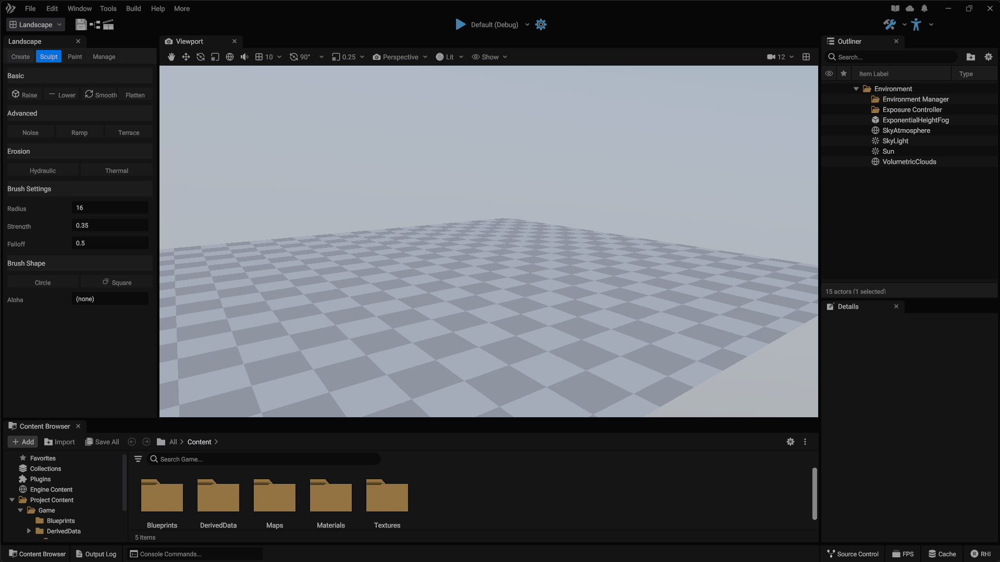

# WindEffects Engine

[](https://en.cppreference.com/w/cpp/23)
[](https://www.vulkan.org/)
[](https://www.microsoft.com/windows)
[](https://github.com/udinmoInc/WindEffects)
[](Legal/EULA.md)

> **Under Active Development**: WindEffects Engine is currently in active development. There are no official or public releases available yet.

WindEffects Engine is a game engine built for professional development using modern C++23 and Vulkan. It emphasizes modular architecture, data-oriented design, and an integrated editor workflow.

## Why WindEffects

- **Modern C++23**: Uses the latest C++ standard for performance and developer productivity
- **Vulkan-Powered**: Built on Vulkan 1.3 for low-overhead graphics and modern GPU features
- **Editor-First**: Integrated editor with real-time preview and tooling
- **High Performance**: Data-oriented design, ECS architecture, multi-threaded job system
- **Modular Architecture**: Independent, reusable modules with clean interfaces
- **PBR Rendering**: Physically-based rendering with HDR, deferred and forward+ paths

## Screenshots



<p align="center"><em>WindEffects Engine — in-development first look.</em></p>

## Quick Start

```powershell
# Clone the repository
git clone https://github.com/udinmoInc/WindEffects.git
cd WindEffects

# Build the engine
dotnet build Engine/Source/Programs/IgniteBT/Source/IgniteBT.csproj -c Debug
.\we.ps1 build --config Debug

# Run the editor
.\we.ps1 run --target Editor --config Debug
```

For detailed setup instructions, see [Getting Started](#getting-started).

## Table of Contents

- [Introduction](#introduction)
- [Architecture Overview](#architecture-overview)
- [Core Features](#core-features)
- [Rendering System](#rendering-system)
- [Editor Interface](#editor-interface)
- [Getting Started](#getting-started)
- [Building the Engine](#building-the-engine)
- [Project Structure](#project-structure)
- [Development Workflow](#development-workflow)
- [Roadmap](#roadmap)
- [Contributing](#contributing)
- [License](#license)

## Introduction

WindEffects Engine is a modular, performant game engine built on C++23 and Vulkan. It is designed for professional game development with a focus on iteration speed, maintainability, and scalability from indie to AAA projects.

The engine prioritizes an integrated editor experience while keeping underlying systems accessible and well-documented.

### Design Philosophy

- **Modularity**: Systems are independent modules that can be developed, tested, and maintained in isolation
- **Performance**: Critical paths optimized for modern hardware with multi-threading and GPU acceleration
- **Modern C++**: Extensive use of C++23 features including concepts, modules, and improved standard library facilities
- **Data-Oriented Design**: Memory layouts and data structures optimized for cache efficiency and SIMD operations
- **Editor-First**: Development experience centers around a powerful, intuitive editor interface

## Architecture Overview

WindEffects Engine is organized into major subsystems with clear interfaces, allowing teams to work independently.

### Engine Core

The core system provides foundational services: memory management, threading primitives, reflection, and the ECS architecture. Custom allocators handle different allocation patterns (small objects, large buffers, GPU memory) to reduce fragmentation and improve allocation speed.

### Build System

WindEffects uses IgniteBT, a custom build system written in C#. The `we` command provides a unified interface for dependency resolution, compilation, linking, and packaging. The build system keeps all generated artifacts outside the source tree and provides diagnostics through the `doctor` command.

## Core Features

### Entity Component System

A modern ECS architecture separates data from behavior for efficient data-oriented processing and cache-friendly memory layouts. Entities are unique identifiers, components hold pure data, and systems operate on component queries.

- Efficient parallel processing of game logic
- Cache-friendly data access patterns
- Flexible composition of game objects
- Straightforward serialization and networking

Archetype-based storage stores entities with the same component types contiguously, maximizing cache locality during system updates.

### Job System

Framework for parallelizing work across CPU cores with task dependencies, work stealing, and affinity scheduling. Integrates with ECS for parallel entity query updates.

### Asset Pipeline

Custom asset pipeline for importing, processing, and managing game assets (meshes, textures, materials, animations, audio). Offline processing into optimized runtime formats with hot-reloading during development. Stable GUIDs for asset references enable safe refactoring.

### Reflection System

Compile-time reflection built with C++ attributes and code generation enables runtime type information, serialization, and editor integration with zero runtime overhead. Powers the property inspector, serialization, and scripting interfaces.

## Rendering System

Built on Vulkan with low-level GPU access and higher-level abstractions. Scales from integrated graphics to high-end GPUs.

### Graphics Features

- **PBR**: Metallic/roughness and specular/glossiness workflows
- **Deferred and Forward+**: Multiple rendering paths optimized for different scenarios
- **HDR Rendering**: Tone mapping and exposure control
- **Render Graph**: Frame graph system for automatic render pass dependencies and resource transitions
- **GPU-Driven Rendering**: Compute-based culling and draw dispatch
- **Bindless Resources**: Descriptor indexing for efficient resource access
- **Ray Tracing**: Hardware-accelerated ray tracing (planned)
- **Path Tracing**: Full path tracing for cinematic rendering (planned)

### Shader Pipeline

HLSL shaders compiled to SPIR-V. Unified shader format targets multiple APIs. Automatic shader permutation generation for quality settings and feature combinations.

## Editor Interface

Built on a custom retained-mode UI framework. Fully dockable workspace with customizable layouts.

### Main Components

**Scene Viewport**: Central workspace with real-time rendering, multiple camera modes, gizmos, and manipulation tools.

**World Outliner**: Hierarchical view of scene entities with filtering, searching, and grouping. Selection syncs with viewport and inspector.

**Property Inspector**: Reflection-driven editing of entity components with automatic UI generation and custom editor support.

**Content Browser**: Asset management with preview, filtering, and drag-and-drop placement.

**Console**: Integrated command console with auto-completion and custom command registration.

### Workspace Customization

Panels can be rearranged, docked, undocked, or tabbed. Multiple workspace configurations can be saved and switched.

## Getting Started

### Prerequisites

- **Operating System**: Windows 10 or Windows 11 (64-bit)
- **Compiler**: Visual Studio 2022 with C++ workload and latest updates
- **.NET SDK**: .NET 8.0 SDK for building IgniteBT
- **Vulkan SDK**: Latest Vulkan SDK for graphics development
- **Git**: For version control
- **CMake**: Optional; some third-party dependencies may use CMake

### Initial Setup

1. Clone the repository
2. Install all prerequisites and ensure they are accessible from command line
3. Open a terminal in the repository root
4. Run the setup command to configure the build environment

The first build compiles IgniteBT and downloads dependencies, so it takes longer than subsequent builds.

## Building the Engine

WindEffects uses the `we` command-line tool (wrapper around IgniteBT) for all build operations.

### Basic Build Commands

```powershell
# Build in Debug configuration
we build --config Debug

# Build in Development configuration (optimized with debugging symbols)
we build --config Development

# Build in Shipping configuration (fully optimized)
we build --config Shipping

# Clean build artifacts for a specific configuration
we clean --config Debug

# Rebuild (clean then build) for a specific configuration
we rebuild --config Debug

# Run the editor after building
we run --target Editor --config Debug
```

### Advanced Build Options

```powershell
# Build specific modules or targets
we build --target WECore --config Debug
we build --target WERenderer --config Debug

# Build with increased parallelism
we build --config Debug --jobs 8

# Generate build reports
we build --config Debug --report

# Verbose output for debugging build issues
we build --config Debug --verbose
```

### Diagnostic Commands

```powershell
# Check environment and dependencies
we doctor

# Display version information
we version

# Detect installed SDKs and tools
we sdk detect

# List available plugins
we plugin list

# List configured projects
we project list
```

### Bootstrapping IgniteBT

On first use, `we` may need to bootstrap the IgniteBT build system:

```powershell
dotnet build Engine/Source/Programs/IgniteBT/Source/IgniteBT.csproj -c Debug
we build --config Debug
```

After initial bootstrap, IgniteBT is cached for faster subsequent builds.

## Project Structure

```
WindEffects/
├── Engine/
│   ├── Source/              # All engine source code
│   │   ├── Runtime/         # Runtime engine systems
│   │   ├── Editor/          # Editor-specific code
│   │   └── Programs/        # Production apps + IgniteBT
│   │       ├── Editor/      # WindEffectsEditor.exe
│   │       ├── WeLauncher/  # WeLauncher.exe
│   │       ├── We/          # we.exe (native CLI)
│   │       ├── CrashReporter/
│   │       └── IgniteBT/    # Build system (Source, Launcher, Tests, Docs)
│   ├── ThirdParty/          # Third-party library sources
│   ├── Content/             # Engine assets and resources
│   ├── Config/              # Configuration files
│   └── Shaders/             # Shader source files
├── Build/                   # Generated build artifacts (gitignored)
│   ├── Output/              # Final compiled binaries
│   ├── Intermediate/        # Object files and incremental data
│   ├── Generated/           # Generated source files
│   ├── Cache/               # Build cache
│   ├── Database/            # Asset database
│   ├── Logs/                # Build and runtime logs
│   └── Manifest/            # Build manifests
├── Assets/                  # Project-specific assets
├── Legal/                   # Legal documents and licenses
├── WindEffects.engine       # Project descriptor file
├── we                       # Unix-style launcher script
├── we.bat                   # Windows batch launcher
├── we.ps1                   # PowerShell launcher
└── IgniteBT.SDKs.json       # SDK configuration
```

### Source Organization

- **Runtime**: Engine systems that run in both editor and shipped games (core, renderer, physics, audio, game framework)
- **Editor**: Editor-specific functionality (UI, tools, editor-only systems). Not included in shipped games.
- **Programs**: Production executables (`Editor`, `WeLauncher`, `We`, `CrashReporter`) plus IgniteBT under `Programs/IgniteBT/` with source, launcher, tests, and docs.

### Build Artifacts

The `Build` directory is excluded from version control:

- **Output**: Final compiled binaries by configuration and platform
- **Intermediate**: Object files, PDB debug symbols, incremental link data (safe to delete for clean rebuild)
- **Generated**: Build-time generated files (export definitions, reflection code)
- **Cache**: Cached data for faster subsequent builds
- **Database**: Asset database for content browser and asset pipeline
- **Logs**: Build and runtime logs
- **Manifest**: Build manifests for launcher and build system

## Development Workflow

### Typical Development Cycle

1. Pull latest changes
2. Build the engine: `we build --config Development`
3. Launch the editor: `we run --target Editor --config Development`
4. Work in the editor (create content, test features, iterate)
5. Make code changes
6. Rebuild: `we build --config Development`
7. Test changes in the editor
8. Commit with descriptive messages

### Debugging

Use Development configuration for debugging (debug symbols with reasonable performance). Debug configuration has full debugging but may be too slow for interactive work.

To attach a debugger:
1. Build in Development or Debug configuration
2. Launch the editor through your debugger
3. Set breakpoints in engine source code
4. Interact with the editor to trigger target code paths

### Hot Reloading

- Shader changes: automatically recompiled and reloaded
- Asset changes: automatic reimport
- C++ code changes: currently require rebuild and editor restart (hot-reload planned)

## Roadmap

### Phase 1: Foundation (Current)

- Core engine systems and architecture
- Window system and platform abstraction
- Vulkan renderer with basic PBR
- Asset manager and basic asset pipeline
- Scene system and entity management
- Editor foundation and basic UI

### Phase 2: Core Systems

- Entity Component System implementation
- Physics integration (planned)
- Audio system (planned)
- Input framework and action mapping
- Material system and shader editor

### Phase 3: World Systems

- Animation system and skeletal meshes
- Terrain system with heightmaps and splatmaps
- World streaming for large environments
- Navigation mesh generation and AI pathfinding
- AI framework with behavior trees

### Phase 4: Advanced Features

- Networking and multiplayer support
- Visual scripting system
- Packaging and deployment tools
- Production-ready profiling tools
- Additional platform support (Linux, consoles)

## Contributing

WindEffects Engine is currently in early development and not accepting external contributions. Feedback, bug reports, and discussions are welcome.

When contributions open, guidelines will cover:
- Code style and formatting standards
- Pull request process
- Testing requirements
- Documentation expectations

### Reporting Issues

Provide:
- Steps to reproduce
- Expected vs. actual behavior
- Environment information (OS, hardware, configuration)
- Relevant log files or error messages
- Screenshots or recordings if applicable

## Community & Support

- **Discussions**: [GitHub Discussions](https://github.com/udinmoInc/WindEffects/discussions)
- **Issues**: [GitHub Issues](https://github.com/udinmoInc/WindEffects/issues)

## License

WindEffects Engine is under active development and not yet publicly licensed. License information will be provided at stable public release.

For licensing inquiries or commercial use questions, contact the development team.

## Acknowledgments

WindEffects Engine incorporates third-party software and assets. Each component is subject to its respective license terms. See [Legal/THIRD_PARTY_NOTICES.md](Legal/THIRD_PARTY_NOTICES.md) for details.

---

For technical support or inquiries, contact the development team through official channels.